# TripBuddy

**예산과 취향에 맞춰 여행을 계획하고, 현지에서 바뀐 일정까지 관리하는 AI 여행 플랫폼**

교통편·숙소·관광지를 따로 찾고, 이동 시간과 비용을 다시 맞추는 여행 준비의 번거로움에서 출발했습니다. TripBuddy는 조건 선택부터 AI 일정 생성, 지도·경비 확인과 일정 수정까지 하나의 흐름으로 연결한 팀 프로젝트입니다.

**이시우 · 서비스 기획 / 프론트엔드 구현 / API 연동 / 시연·발표 자료 구성**  
더존비즈온 Cloud DX Academy 팀 프로젝트 · 대표 시연: 3인 제주 2박 3일

### 먼저, 완성된 서비스를 보세요

[](https://siu92.github.io/TripBuddy/?play=1#demo)

**[▶ 시연 영상 바로 재생 · 6분 21초 / 1080p](https://siu92.github.io/TripBuddy/?play=1#demo)** · **[발표자료 웹에서 넘겨보기](https://siu92.github.io/TripBuddy/#presentation)**  
다운로드: [영상 MP4](https://github.com/siu92/TripBuddy/releases/download/demo-2026-10-02/TripBuddy_demo.mp4) · [발표 PDF](https://github.com/siu92/TripBuddy/releases/download/demo-2026-10-02/TripBuddy_presentation.pdf) · [발표 PPT](https://github.com/siu92/TripBuddy/releases/download/demo-2026-10-02/TripBuddy_presentation.pptx)

아래 설명에서는 주요 장면을 바로 볼 수 있습니다. 전체 영상과 발표자료는 별도 설치나 로그인 없이 웹 미리보기에서 확인할 수 있습니다.

## 제가 맡은 일

사용자가 어떤 순서로 선택하고, 결과를 어떻게 확인하고 수정할지 정리한 뒤 React 화면과 API 연동으로 구현했습니다. 화면을 만드는 데서 끝내지 않고, 앞 단계의 선택값이 최종 일정과 예상 경비에 이어지도록 연결했습니다.

| 담당 범위 | 실제 작업 |
| --- | --- |
| 서비스 기획 | 예산·출발지·목적지·날짜·교통·숙소·취향을 선택하는 사용자 흐름 구성 |
| 프론트엔드 | 조건 입력, 비교·선택, 날짜별 일정, 지도·경비 및 모바일 화면 구현 |
| API 연동 | 서버 응답 변환, AI 생성 대기·완료 상태, 오류·재시도 처리 |
| 협업·발표 | 백엔드·인프라 담당자와 API·배포 조건 조율, 기능 시연과 발표자료 구성 |

백엔드·AWS 인프라는 각 담당자와 협업한 팀 결과물입니다. 아래에서는 제가 담당한 사용자 화면과 연결 과정을 중심으로 소개합니다.

## UI·UX 설계: 앞의 선택이 다음 선택의 기준이 되도록

TripBuddy의 출발점은 **‘주어진 예산 안에서 여행 일정을 만든다’**는 목표였습니다. 그래서 예산을 가장 먼저 배치했습니다. 여행지를 먼저 고르고 나중에 비용을 맞추기보다, 사용자가 생각한 예산을 이후 선택과 일정 생성의 기준으로 삼는 흐름을 만들고자 했습니다.

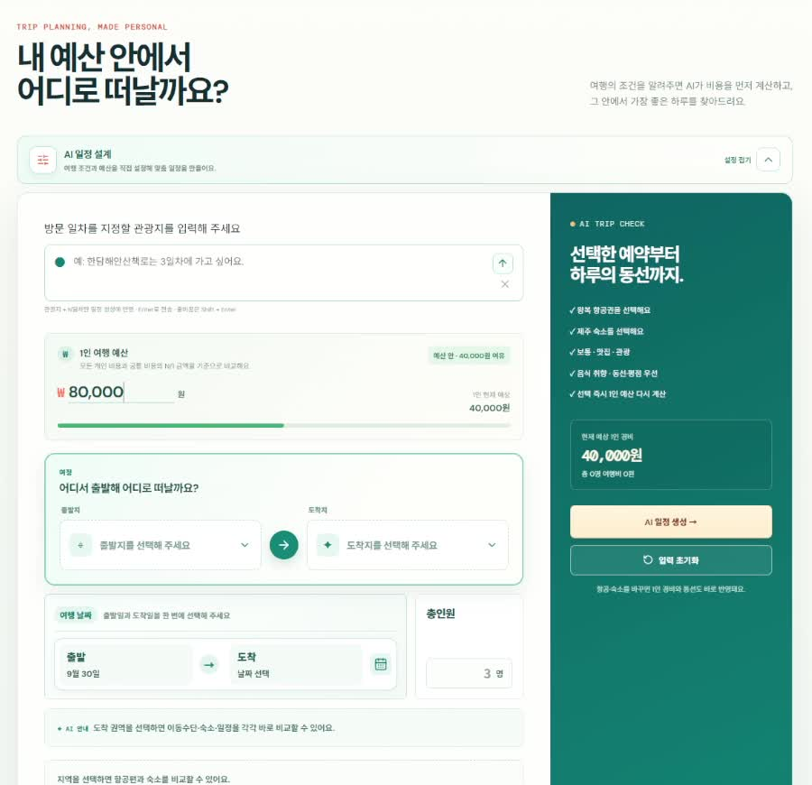

### 출발지는 위치의 정확성, 도착지는 여행자의 생각을 기준으로

국내 여행도 항공·KTX·자차 등 이동 방식이 다양합니다. 특히 자차는 출발 위치가 첫 이동 구간과 전체 일정에 영향을 줍니다. ‘서울·경기’처럼 큰 지역만으로는 출발 지점을 충분히 좁힐 수 없어, 시·구·동 단위까지 선택하는 행정권역 지도와 주소 입력을 구성했습니다.

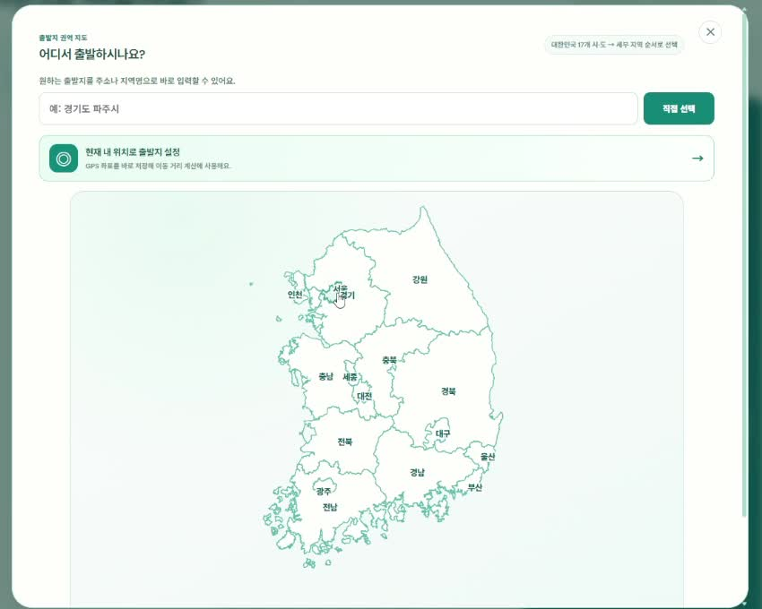

반면 여행 목적지를 떠올릴 때는 ‘강원도 어느 구’보다 ‘속초에 갈까, 해운대에 갈까’라고 생각합니다. 도착지는 행정구역을 그대로 반복하지 않고, 여행자가 실제로 떠올리는 관광 지역과 명소를 중심으로 편성했습니다. **출발지와 도착지의 입력 방식은 서로 다른 판단을 돕기 위한 선택**이었습니다.

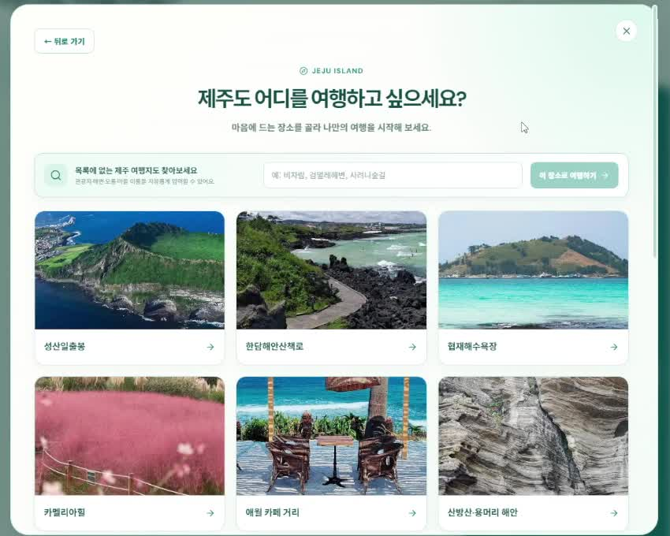

### 날짜를 먼저 정해야 교통과 숙소를 선택할 수 있다

날짜는 한눈에 살펴보고 선택할 수 있는 캘린더 형식을 채택했습니다. 두 달을 나란히 보여줘 월말·월초 여행도 화면을 오가지 않고 선택할 수 있게 했습니다. 이후 교통편과 숙소 선택이 여행 날짜를 기준으로 이어지므로, 날짜를 그보다 먼저 배치했습니다.

숙소 위치는 관광지와 식당을 배치하는 기준점입니다. 숙소를 정하려면 먼저 정확한 여행 날짜가 필요하고, 그 날짜의 객실 상황을 확인해야 한다는 판단도 순서 설계에 반영했습니다. **날짜 → 교통·숙소 → 숙소를 기준으로 한 현지 일정**이 연결되는 구조입니다.

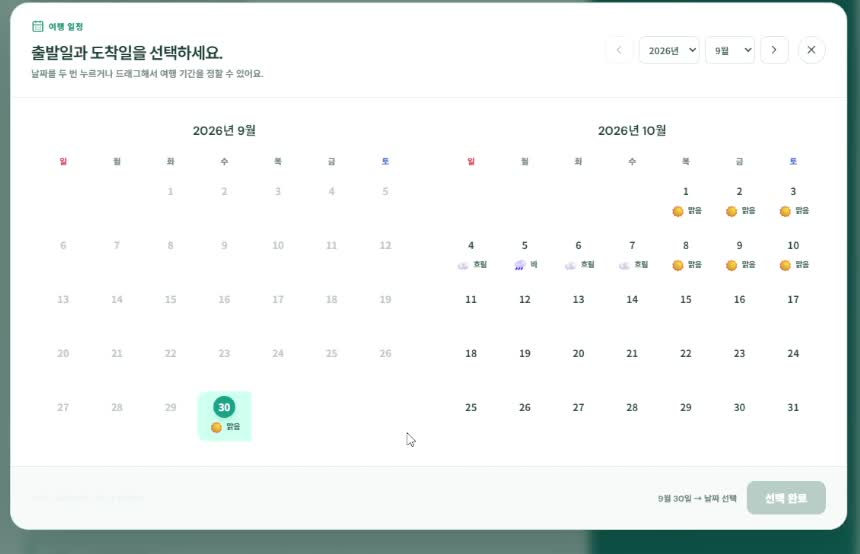

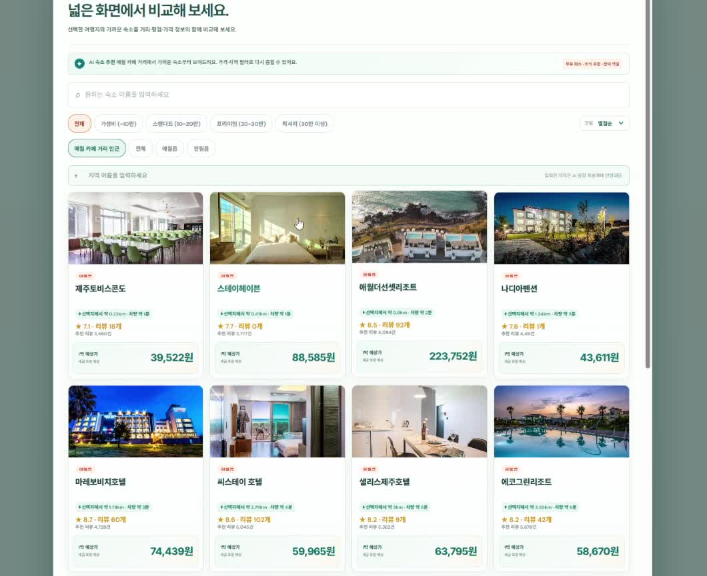

### 출발시각은 모든 사용자에게 묻지 않는다

초기에는 날짜 선택 화면에 출발시각도 넣었지만, 항공과 KTX는 선택한 티켓의 출발·도착 시각이 일정의 기준이라는 점을 고려해 공통 입력에서 제거했습니다. 의미가 겹치는 선택을 줄이고, 교통편 선택 결과가 시간 기준으로 이어지도록 바꿨습니다.

자차는 사용자가 이동 시각을 직접 정해야 하므로, 대표 교통수단을 자차로 선택한 경우에 출발·도착 시각을 설정하는 흐름을 구성했습니다. **같은 시간 정보라도 교통수단에 따라 필요한 시점에 묻는 방식**입니다.

### 마지막에 취향을 더해 맞춤 일정으로

교통편과 숙소로 여행의 기본 틀을 정한 뒤, 마지막에 여행 테마와 선호 음식을 선택하도록 배치했습니다. 이동·숙박 조건을 갖춘 일정에 사용자가 원하는 여행 스타일과 식당 취향을 더해, 같은 지역에서도 개인에게 맞는 일정을 생성하려는 설계입니다.

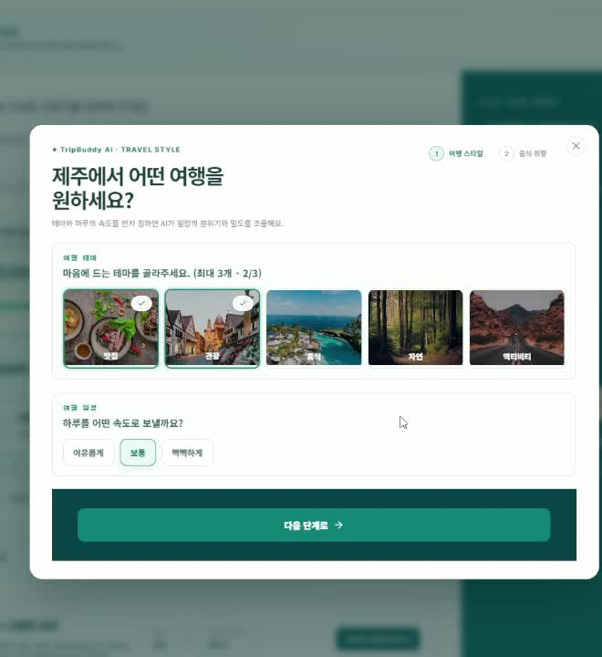

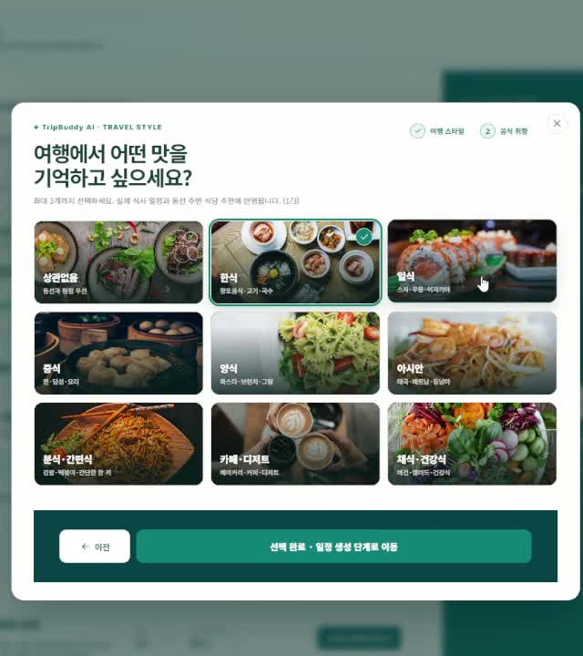

이 단계들은 독립된 설문 문항이 아닙니다. 예산이 여행의 기준이 되고, 위치와 날짜가 교통·숙소 선택에 영향을 주며, 선택한 교통편과 숙소가 최종 동선과 시간표로 이어지도록 설계했습니다.

## 1. 여행 준비를 하나의 선택 흐름으로

국내 대표 여행지와 명소를 선택하고, 예산·인원·날짜를 정한 다음 교통편과 숙소를 비교하도록 구성했습니다. 국내 여러 지역의 여행 조건을 받을 수 있도록 만들었으며, 실제 시연에서는 서울 출발·제주 애월 중심의 여행을 끝까지 진행합니다.

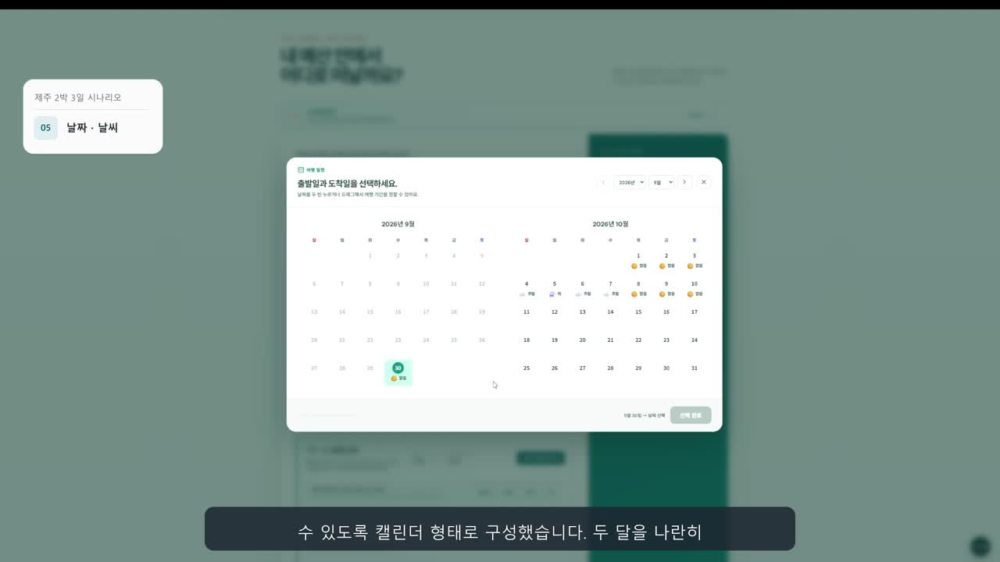

**화면에서 고려한 점:** 두 달을 함께 보여주는 달력으로 월말·월초 일정을 선택하고, 비교할 정보는 카드에 모았습니다. 마지막 확인 단계에서 바꾸고 싶은 항목만 다시 선택할 수 있도록 했습니다.

[▶ 이 장면 보기 · 01:03부터](https://siu92.github.io/TripBuddy/?play=1&t=63#demo)

## 2. 선택한 조건을 실제 일정으로 연결

항공편의 출발·도착 시각과 숙소 위치, 취향을 일정 생성 요청에 연결했습니다. 결과에서는 날짜별 시간표와 지도 동선을 함께 확인할 수 있습니다. 공항 이동과 현지 관광 구간을 구분해 여행의 시작과 마무리까지 이어지도록 처리했습니다.


**구현에서 고려한 점:** AI 생성은 시간이 걸리는 작업입니다. 요청 후 처리 상태를 확인하고, 완료된 결과를 화면에 표시하도록 백엔드 담당자와 연결했습니다.

[▶ 생성 결과 보기 · 03:57부터](https://siu92.github.io/TripBuddy/?play=1&t=237#demo)

## 3. 생성 후에도 사용자가 직접 바꾸는 일정

여행 중에는 방문 순서나 식당이 바뀔 수 있습니다. 시간표 카드를 드래그해 순서를 바꾸고, 주변의 다른 장소로 교체하거나 일정을 추가·삭제할 수 있도록 구현했습니다. 바뀐 동선과 이동 시간을 이어서 확인합니다.

[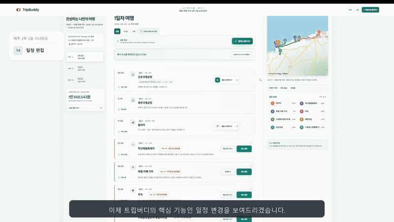](https://siu92.github.io/TripBuddy/?play=1&t=275#demo)

[▶ 일정 수정 영상 재생 · 04:35부터](https://siu92.github.io/TripBuddy/?play=1&t=275#demo)  
다운로드: [전체 시연 영상](https://github.com/siu92/TripBuddy/releases/download/demo-2026-10-02/TripBuddy_demo.mp4)

경비 화면에서는 예상 금액을 항목별로 나누고, 일정 화면과 경비 화면의 금액 기준이 달라지지 않도록 연결했습니다.

<details>
<summary>예상 경비 화면 펼쳐보기</summary>

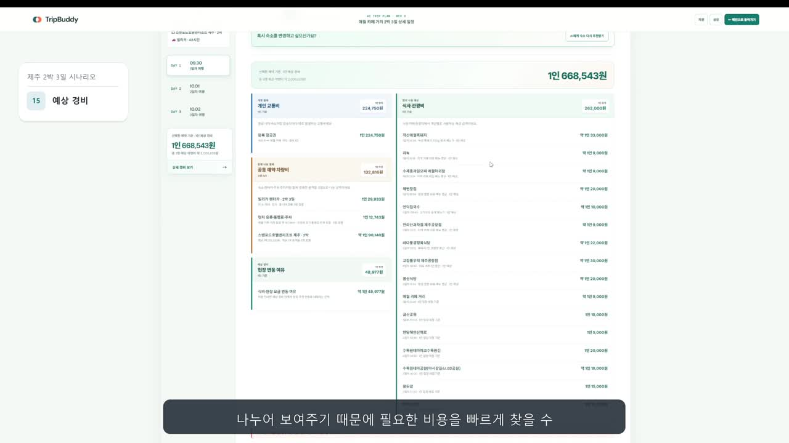

[▶ 경비 확인 · 05:19부터](https://siu92.github.io/TripBuddy/?play=1&t=319#demo)

</details>

## 4. 여행지에서도 이어지는 모바일 경험

PC에서 계획을 세운 뒤에도 모바일에서 일정과 경로를 확인하고 수정할 수 있도록 반응형 화면을 구성했습니다. 모바일에서도 방문 순서 변경과 대체 장소 선택 흐름을 이어갑니다.

[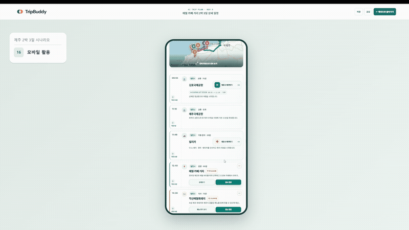](https://siu92.github.io/TripBuddy/?play=1&t=329#demo)

[▶ 모바일 시연 재생 · 05:29부터](https://siu92.github.io/TripBuddy/?play=1&t=329#demo)

## 기획 배경과 팀의 구현 과정

여행 준비와 일정 변경에서 발견한 불편을 정리하고, 사용자 화면·데이터·AI·배포 구조를 하나의 서비스로 연결했습니다. 발표자료는 아래 이미지를 누르면 **웹에서 슬라이드별로 넘겨볼 수 있습니다.**

| 여행 준비의 불편 | 생성 후 일정 변경의 불편 |
| --- | --- |
| [](https://siu92.github.io/TripBuddy/?slide=2#presentation) | [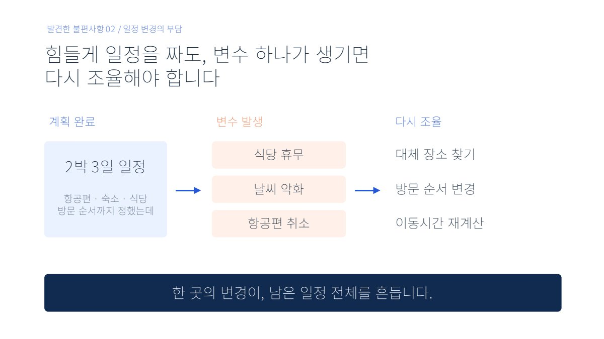](https://siu92.github.io/TripBuddy/?slide=4#presentation) |

**[발표자료 46장 웹에서 보기](https://siu92.github.io/TripBuddy/#presentation)**  
다운로드: [PDF](https://github.com/siu92/TripBuddy/releases/download/demo-2026-10-02/TripBuddy_presentation.pdf) · [영상이 포함된 PPT 원본](https://github.com/siu92/TripBuddy/releases/download/demo-2026-10-02/TripBuddy_presentation.pptx)

## 구현 근거와 확인 범위

API 계층에서 좌표·거리·시간·가격을 공통 형식으로 변환하고, 인증·세션·오류 처리를 공통화했습니다. 운영 빌드 검사에서는 로컬 API 주소나 지도 키 누락을 확인하도록 구성했습니다.

관련 코드: [API 공통 처리](frontend/src/api/apiClient.js) · [AI 일정 연동](frontend/src/api/tripPlanApi.js) · [일정 편집 화면](frontend/src/components/planner/PlanFullscreen.jsx) · [경비 계산](frontend/src/utils/costEstimate.js)

**시연 범위:** 항공·숙소 금액은 예상 견적이며, 렌터카 업체·가격은 시연용 데이터입니다. 일부 상세 정보는 요청 실패 시 대체 데이터를 사용합니다. 실제 결제·예약 확정 기능이나 국내 모든 지역의 품질 검증을 의미하지 않습니다.

**운영 안내:** 실습용 AWS 환경은 2026년 10월 8일 종료 예정입니다. 이후 온라인 AI 생성·외부 데이터 조회는 이용할 수 없지만, 이 페이지의 녹화 영상과 발표자료는 계속 확인할 수 있습니다.

<details>
<summary>팀 저장소와 개발 이력 확인</summary>

### 저장소와 개발 이력 안내

이 저장소는 팀 프로젝트의 구현 결과와 발표 자료를 모아 공개한 포트폴리오용 저장소입니다. 원래 개발은 프론트엔드와 백엔드의 **별도 비공개 팀 저장소**에서 진행했으며, 기존 커밋 기록은 해당 저장소에 보존되어 있습니다.

공개 저장소에는 구현 결과를 복사해 통합했으므로, 이곳의 커밋 기록과 기여자 표시는 **팀 전체의 개발 이력이나 개인별 기여도를 나타내지 않습니다.** 주요 담당 범위와 협업 내용은 위의 ‘담당 역할과 협업’ 항목에 구분해 정리했습니다.

<details>
<summary>기존 팀 저장소 개발 이력 보기 — 프론트엔드·백엔드</summary>

아래는 **2026년 10월 2일 기준** 비공개 팀 저장소 화면입니다. 프론트엔드 58개, 백엔드 74개의 커밋이 보존되어 있습니다. 화면의 `Private` 표시와 커밋 수로 원래 개발 저장소의 상태를 확인할 수 있습니다.

#### 프론트엔드 팀 저장소


#### 백엔드 팀 저장소


</details>


</details>

<details>
<summary>기술 구성·실행 방법·검증 기록 확인</summary>

## 기술 구성

| 영역 | 기술 |
| --- | --- |
| 프론트엔드 | React 19, Vite 8, Tailwind CSS 4, Axios, `@hello-pangea/dnd` |
| 지도·모바일 | Kakao Maps JavaScript API, 반응형 화면, Vite PWA |
| 백엔드 | Java 21, Spring Boot 4, Spring Security, Spring Data JPA, JWT |
| 데이터·AI | MariaDB, Redis, Amazon Bedrock Nova Lite, Amazon SQS |
| 배포 구성 | Docker, Kubernetes 배포 설정, 프론트 CloudFront API 경로 연동 |
| 검증 | Node.js 테스트, JUnit, JaCoCo, SonarQube 설정 |

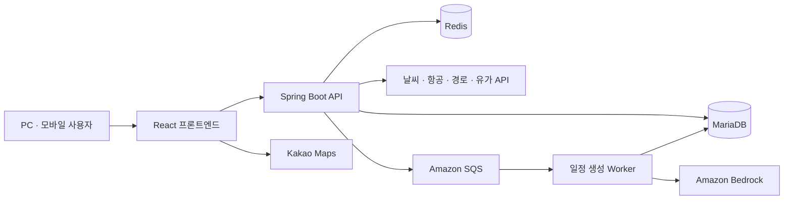

위 구성은 팀의 구현 구조입니다. 실제 실행에는 데이터베이스, 외부 API 및 AWS 환경설정이 필요하며, 이 저장소에는 개인 인증 정보나 운영 비밀값을 포함하지 않습니다.

## 데이터와 시연 범위

날씨·장소·지도 경로 등은 외부 API와 백엔드 데이터를 활용합니다. 일부 상세 정보는 요청 실패 시 시연용 대체 데이터를 사용합니다. **항공·숙소 등 예약 관련 금액은 예상 견적이며, 렌터카 업체·가격 정보는 시연용 데이터입니다.** 실제 결제·예약 확정 서비스와는 구분합니다.

PWA는 설치와 정적 자산 캐시를 지원합니다. AI 생성·지도·최신 외부 데이터 조회에는 네트워크 연결이 필요합니다.

## 프로젝트 구조

```text
TripBuddy/
├─ frontend/       사용자 화면, API 연동, 지도, 모바일, 테스트
├─ backend/        인증, 추천, 경비, AI 일정 생성, 배포 설정
└─ docs/images/    실제 시연 화면
```

## 실행과 검증

<details>
<summary>개발 환경과 실행 방법</summary>

Node.js는 Vite 8이 지원하는 버전을, 백엔드는 JDK 21을 사용합니다. MariaDB와 외부 API 접근 환경을 별도로 준비해야 합니다.

프론트엔드:

```powershell
cd frontend
npm ci
Copy-Item .env.example .env.development.local
# API 주소와 발급받은 Kakao JavaScript 키를 설정합니다.
npm run dev
```

백엔드:

```powershell
cd backend
Copy-Item .env.example .env.local
# DB, JWT, 외부 API 및 AWS 관련 값을 자신의 환경에 맞게 설정합니다.
.\gradlew.bat bootRun --args="--spring.profiles.active=local"
```

AI 일정 생성 기능은 API와 Worker 역할, SQS 큐 및 Bedrock 접근 권한 설정이 추가로 필요합니다. 설정 항목은 [백엔드 환경변수 예시](backend/.env.example)와 [애플리케이션 설정](backend/src/main/resources/application.yaml)을 참고하세요.

프론트 검증:

```powershell
cd frontend
npm test
npm run build
# 운영 환경값을 준비한 뒤 실행합니다.
npm run build:release
```

2026년 10월 2일 공개본 준비 시 프론트 자동 테스트 **30개가 통과**했습니다. API 응답 변환, 경비 일관성, 항공편 정렬, 장소 좌표, 요청 캐시와 비동기 일정 생성 흐름 등을 검증합니다. 백엔드 테스트는 이번 공개본 정리 작업에서 재실행하지 않았습니다.

</details>

본 프로젝트는 더존비즈온 Cloud DX Academy 교육 과정에서 팀 협업으로 제작되었습니다.

</details>
