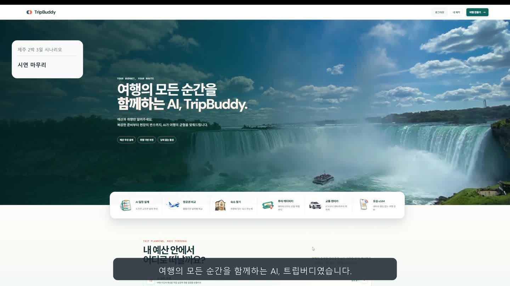
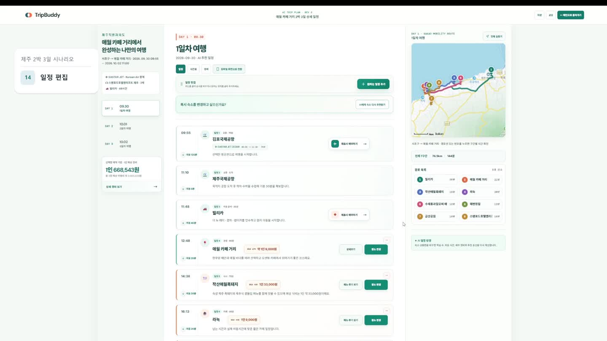
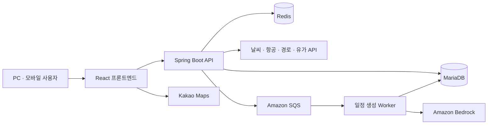

# TripBuddy

**예산과 취향에서 시작해, 여행 일정과 현지 동선까지 연결하는 AI 여행 플랫폼**

TripBuddy는 교통편·숙소·방문 장소를 각각 찾고 일정과 비용을 다시 맞춰야 하는 여행 준비의 번거로움을 줄이기 위해 만든 팀 프로젝트입니다. 사용자가 여행 조건을 입력하고 교통편과 숙소를 선택하면, AI가 날짜별 일정을 구성하고 지도 동선과 예상 경비를 함께 보여줍니다. 생성된 일정은 사용자가 직접 수정할 수 있습니다.

더존비즈온 Cloud DX Academy 최종 프로젝트로 제작했으며, 대표 시연은 **3명이 함께 떠나는 제주 2박 3일 여행**입니다.

[시연 영상](https://github.com/siu92/TripBuddy/releases/download/demo-2026-10-02/TripBuddy_demo.mp4) · [발표 자료 PDF](https://github.com/siu92/TripBuddy/releases/download/demo-2026-10-02/TripBuddy_presentation.pdf) · [발표 자료 PPT](https://github.com/siu92/TripBuddy/releases/download/demo-2026-10-02/TripBuddy_presentation.pptx) · [자료 모음](https://github.com/siu92/TripBuddy/releases/tag/demo-2026-10-02)



> 실습용 AWS 환경은 2026년 10월 8일 종료 예정입니다. 운영 환경 종료 후에도 위 시연 영상과 발표 자료에서 구현 결과를 확인할 수 있습니다.

## 사용 흐름

**예산·출발지·여행지·날짜·인원 입력 → 교통편·숙소 선택 → 여행 취향 설정 → AI 일정 생성 → 일정·동선·경비 확인 및 수정**

| 기능 | 사용자가 할 수 있는 일 |
| --- | --- |
| 여행 조건 설정 | 예산, 지역, 날짜, 인원, 여행 테마와 선호 음식을 설정합니다. |
| 교통편·숙소 비교 | 왕복 항공편과 현지 이동수단을 선택하고, 지역·가격대에 맞는 숙소를 확인합니다. |
| AI 일정 생성 | 선택한 교통편·숙소 조건과 취향을 바탕으로 날짜별 일정을 생성합니다. |
| 일정 편집 | 드래그 앤 드롭으로 순서를 바꾸거나, 장소를 변경하고 일정을 추가·삭제합니다. |
| 지도와 경비 | 방문 순서, 구간별 이동시간, 전체 경로와 1인 기준 예상 경비를 확인합니다. |
| 모바일 활용 | 모바일에서도 일정·경비·장소 변경·전체 경로를 확인합니다. |



## 담당 역할과 협업

이 저장소는 팀 프로젝트의 프론트엔드와 백엔드 구현을 함께 담은 공개 프로젝트 자료입니다. **저장소 소유자 이시우의 주요 담당 범위는 서비스 기획, 프론트엔드 구현, API 연동 및 발표 준비**입니다. 백엔드와 인프라는 해당 담당자들과 협업했습니다.

- **서비스 기획:** 여행 준비부터 현지 일정 확인까지의 사용자 흐름을 정리하고, 예산·교통·숙소·취향이 일정에 연결되는 화면을 구성했습니다.
- **프론트엔드 구현:** 여행 조건 입력, 비교·선택 화면, 날짜별 일정, 경비, 지도 및 모바일 화면을 구현했습니다.
- **API 연동:** 서버 응답을 화면에서 사용하는 데이터로 연결하고, 일정 생성의 대기·완료 상태와 오류·재시도 흐름을 처리했습니다.
- **팀 협업:** 백엔드·인프라 담당자와 요구사항, API 규격, 데이터 전달 방식 및 배포 환경을 지속적으로 조율했습니다.
- **발표 준비:** 기능 시나리오와 발표 자료, 실제 동작을 보여주는 시연 영상을 구성했습니다.

## 구현에서 중점을 둔 점

### 선택한 조건이 끝까지 이어지는 여행 계획

항공편·숙소·여행 취향 등 앞 단계의 선택값을 일정 요청과 결과 화면으로 연결했습니다. 공항과 항공 구간을 현지 관광 동선에서 구분하고, 일정 화면과 경비 화면에서 금액 기준이 달라지지 않도록 처리했습니다.

### 사용자가 기다리는 동안에도 상태를 알 수 있는 AI 생성 흐름

백엔드에는 SQS 작업 큐와 일정 생성 상태 관리 구조가 구현되어 있습니다. 프론트엔드는 비동기 요청의 처리 상태를 조회해 완료 결과를 표시합니다. 생성 요청과 결과 표시를 분리해, 응답을 기다리는 상황을 화면에 전달합니다.

### 화면과 외부 데이터 사이의 일관된 연결

API 계층에서 문자열 좌표, 거리·시간 단위, 가격 및 상세 정보를 공통 형식으로 변환합니다. 인증·세션과 오류 처리도 공통 계층에서 관리합니다. 운영 빌드 검사는 로컬 API 주소가 번들에 포함되거나 지도 키가 누락된 경우 배포 준비가 실패하도록 구성했습니다.

관련 코드는 [API 공통 처리](frontend/src/api/apiClient.js), [AI 일정 연동](frontend/src/api/tripPlanApi.js), [일정 화면](frontend/src/components/planner/PlanFullscreen.jsx), [경비 계산](frontend/src/utils/costEstimate.js), [백엔드 일정 생성](backend/src/main/java/com/travel/trip/plan)에서 확인할 수 있습니다.

## 기술 구성

| 영역 | 기술 |
| --- | --- |
| 프론트엔드 | React 19, Vite 8, Tailwind CSS 4, Axios, `@hello-pangea/dnd` |
| 지도·모바일 | Kakao Maps JavaScript API, 반응형 화면, Vite PWA |
| 백엔드 | Java 21, Spring Boot 4, Spring Security, Spring Data JPA, JWT |
| 데이터·AI | MariaDB, Redis, Amazon Bedrock Nova Lite, Amazon SQS |
| 배포 구성 | Docker, Kubernetes 배포 설정, 프론트 CloudFront API 경로 연동 |
| 검증 | Node.js 테스트, JUnit, JaCoCo, SonarQube 설정 |



위 구성은 팀의 구현 구조입니다. 실제 실행에는 데이터베이스, 외부 API 및 AWS 환경설정이 필요하며, 이 저장소에는 개인 인증 정보나 운영 비밀값을 포함하지 않습니다.

## 데이터와 시연 범위

날씨·장소·지도 경로 등은 외부 API와 백엔드 데이터를 활용합니다. 일부 상세 정보는 요청 실패 시 시연용 대체 데이터를 사용합니다. **항공·숙소 등 예약 관련 금액은 예상 견적이며, 렌터카 업체·가격 정보는 시연용 데이터입니다.** 실제 결제·예약 확정 서비스와는 구분합니다.

PWA는 설치와 정적 자산 캐시를 지원합니다. AI 생성·지도·최신 외부 데이터 조회에는 네트워크 연결이 필요합니다.

## 프로젝트 구조

```text
TripBuddy/
├─ frontend/       사용자 화면, API 연동, 지도, 모바일, 테스트
├─ backend/        인증, 추천, 경비, AI 일정 생성, 배포 설정
└─ docs/images/    실제 시연 화면
```

## 실행과 검증

<details>
<summary>개발 환경과 실행 방법</summary>

Node.js는 Vite 8이 지원하는 버전을, 백엔드는 JDK 21을 사용합니다. MariaDB와 외부 API 접근 환경을 별도로 준비해야 합니다.

프론트엔드:

```powershell
cd frontend
npm ci
Copy-Item .env.example .env.development.local
# API 주소와 발급받은 Kakao JavaScript 키를 설정합니다.
npm run dev
```

백엔드:

```powershell
cd backend
Copy-Item .env.example .env.local
# DB, JWT, 외부 API 및 AWS 관련 값을 자신의 환경에 맞게 설정합니다.
.\gradlew.bat bootRun --args="--spring.profiles.active=local"
```

AI 일정 생성 기능은 API와 Worker 역할, SQS 큐 및 Bedrock 접근 권한 설정이 추가로 필요합니다. 설정 항목은 [백엔드 환경변수 예시](backend/.env.example)와 [애플리케이션 설정](backend/src/main/resources/application.yaml)을 참고하세요.

프론트 검증:

```powershell
cd frontend
npm test
npm run build
# 운영 환경값을 준비한 뒤 실행합니다.
npm run build:release
```

2026년 10월 2일 공개본 준비 시 프론트 자동 테스트 **30개가 통과**했습니다. API 응답 변환, 경비 일관성, 항공편 정렬, 장소 좌표, 요청 캐시와 비동기 일정 생성 흐름 등을 검증합니다. 백엔드 테스트는 이번 공개본 정리 작업에서 재실행하지 않았습니다.

</details>

본 프로젝트는 더존비즈온 Cloud DX Academy 교육 과정에서 팀 협업으로 제작되었습니다.


