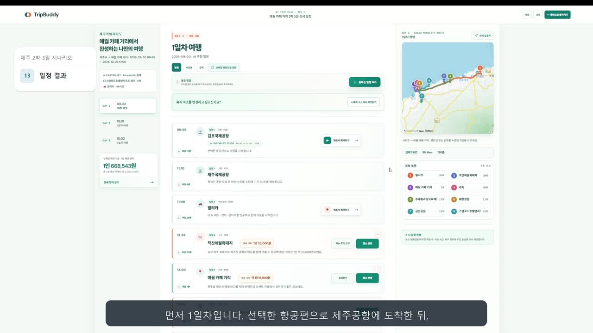
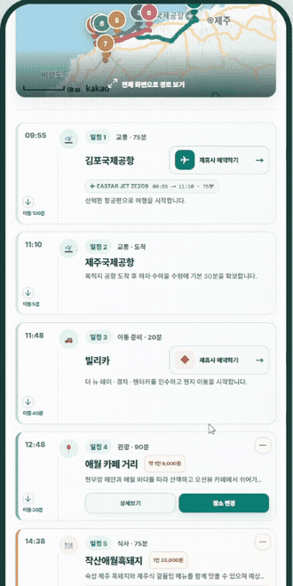
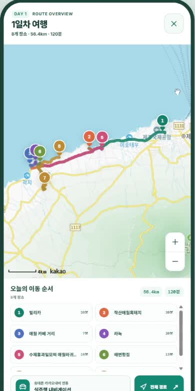
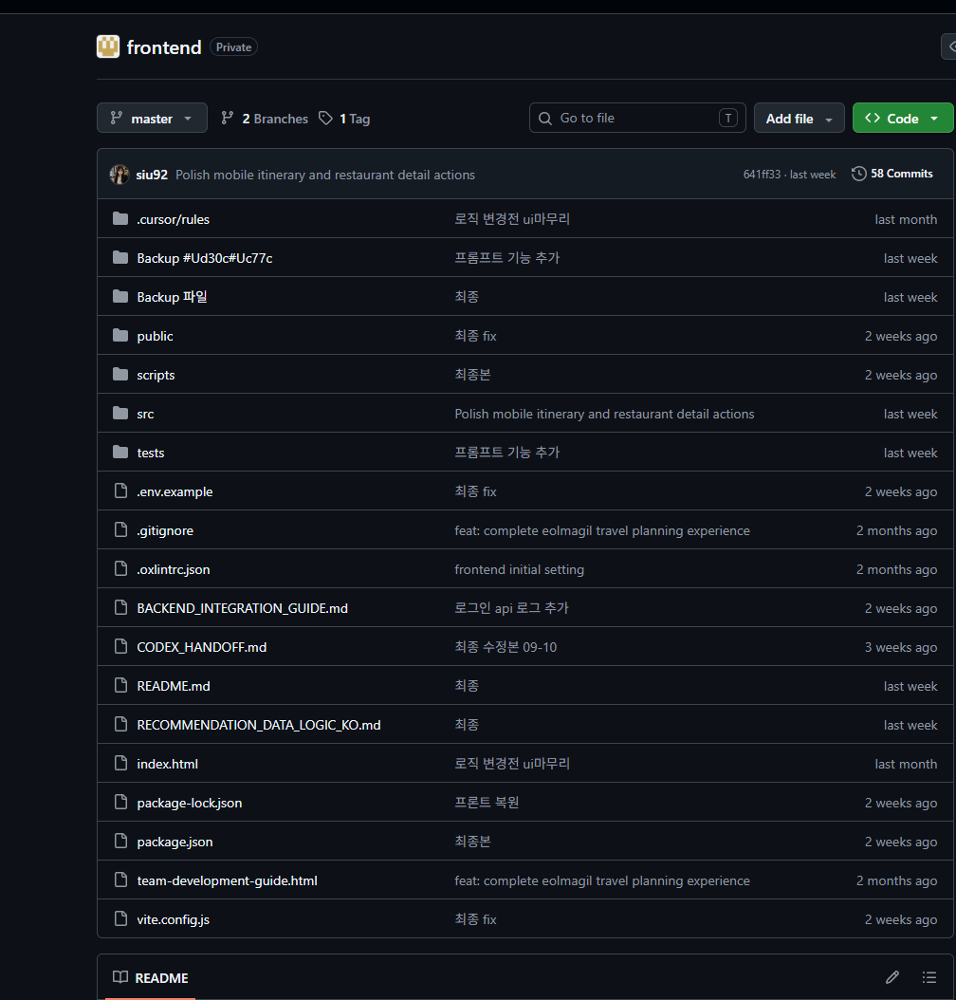
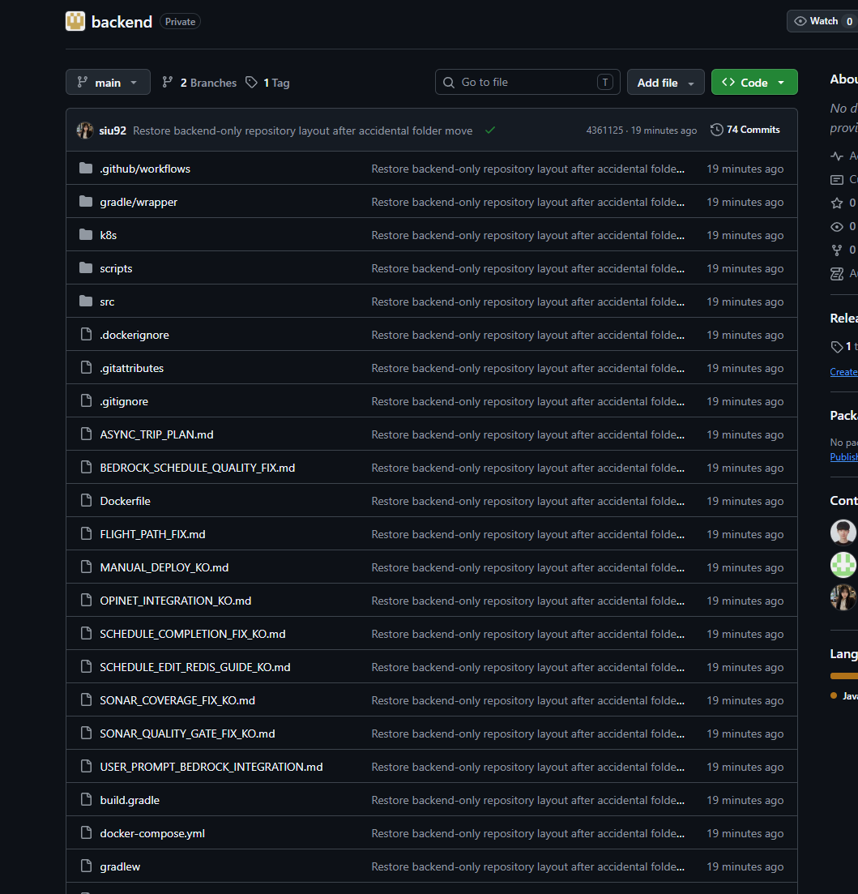
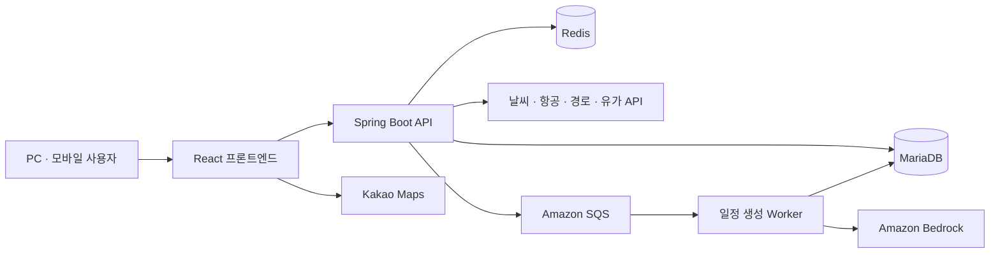

# [🌐 siu92.github.io/TripBuddy](https://siu92.github.io/TripBuddy/)

**TripBuddy 웹 포트폴리오 바로 보기**

**영상과 발표자료는 웹에서 다운로드 없이 볼 수 있습니다.**

[웹 포트폴리오 열기](https://siu92.github.io/TripBuddy/) · [시연 영상](https://siu92.github.io/TripBuddy/?play=1#demo) · [UI·UX 설계](https://siu92.github.io/TripBuddy/#ux) · [모바일 화면](https://siu92.github.io/TripBuddy/#mobile) · [발표자료](https://siu92.github.io/TripBuddy/#presentation)

[](https://siu92.github.io/TripBuddy/)

## TripBuddy

**예산과 취향으로 국내 여행 일정을 만들고, 여행 중에도 수정하는 AI 여행 플랫폼입니다.**

여행 조건에 맞는 교통편과 숙소를 고르면 AI가 날짜별 일정을 만듭니다. 지도와 예상 경비를 함께 확인하고, PC와 모바일에서 방문 순서나 장소를 바꿀 수 있습니다.

더존비즈온 Cloud DX Academy 팀 프로젝트 · 대표 시연: **3인 제주 2박 3일**

## 담당 역할

**이시우 — 서비스 기획 · 프론트엔드 구현 · API 연동 · 시연·발표 자료 구성**

여행 조건 입력부터 일정 확인·수정까지의 화면을 설계하고 React로 구현했습니다. 백엔드·인프라 담당자와 협업해 선택한 조건을 서버에 전달하고, 결과를 화면에 표시했습니다.

## 여행 중에도 사용하는 모바일

PC에서 세운 계획을 모바일로 확인하고, 현지에서 방문 순서나 식당을 바꿀 수 있습니다. 변경한 뒤에는 이동 경로를 확인합니다.

| 방문 순서 변경 | 대체 장소 선택 | 이동 경로 확인 |
| --- | --- | --- |
| [](https://siu92.github.io/TripBuddy/?play=1&t=338#demo) | [](https://siu92.github.io/TripBuddy/?play=1&t=345#demo) | [](https://siu92.github.io/TripBuddy/?play=1&t=360#demo) |

**[모바일 화면과 시연 보기 →](https://siu92.github.io/TripBuddy/#mobile)**

## UI·UX에서 고민한 선택

| 설계한 부분 | 이유 |
| --- | --- |
| 예산을 첫 단계에 배치 | 주어진 예산을 교통·숙소 선택과 일정 생성의 기준으로 쓰기 위해 |
| 출발지는 행정권역·주소로 선택 | 자차 이동 시간에 영향을 주는 출발 위치를 자세히 정하기 위해 |
| 목적지는 관광 지역·명소로 선택 | ‘속초나 해운대에 가고 싶다’는 여행자의 생각에 맞추기 위해 |
| 날짜를 교통·숙소보다 먼저 선택 | 여행 날짜를 알아야 교통편과 객실 상황을 고려할 수 있기 때문에 |
| 출발시각은 자차 선택 때 입력 | 항공·KTX는 티켓 시각을 사용하고, 자차는 직접 정해야 하기 때문에 |
| 여행 테마·음식 취향은 마지막에 선택 | 이동·숙박 조건을 갖춘 뒤 개인 취향을 일정에 더하기 위해 |

날짜는 두 달을 나란히 보여주는 캘린더에서 선택합니다. 완성된 일정은 시간표와 지도에서 확인하고, 방문 순서를 바꾸거나 다른 장소로 교체할 수 있습니다.

**[각 설계의 이유와 실제 화면을 웹에서 보기 →](https://siu92.github.io/TripBuddy/#ux)**

## 국내 다른 여행지로 확장

제주는 대표 시연입니다. **지역별 장소·교통·숙소·경로 데이터가 확보되면 국내 다른 출발지와 목적지에도 같은 방식으로 일정을 만들고 수정할 수 있도록 설계했습니다.**

## 영상·발표자료

| 자료 | 웹에서 보기 | 다운로드 |
| --- | --- | --- |
| 실제 시연 · 1080p / 약 6분 21초 | [영상 재생](https://siu92.github.io/TripBuddy/?play=1#demo) | [MP4](https://github.com/siu92/TripBuddy/releases/download/demo-2026-10-02/TripBuddy_demo.mp4) |
| 기획·구현 발표 · 46장 | [슬라이드 넘겨보기](https://siu92.github.io/TripBuddy/#presentation) | [PDF](https://github.com/siu92/TripBuddy/releases/download/demo-2026-10-02/TripBuddy_presentation.pdf) · [PPT](https://github.com/siu92/TripBuddy/releases/download/demo-2026-10-02/TripBuddy_presentation.pptx) |

## 구현 근거

[API 공통 처리](frontend/src/api/apiClient.js) · [AI 일정 연동](frontend/src/api/tripPlanApi.js) · [일정 편집 화면](frontend/src/components/planner/PlanFullscreen.jsx) · [경비 계산](frontend/src/utils/costEstimate.js)

<details>
<summary>시연 범위와 운영 안내</summary>

항공·숙소 금액은 예상 견적이며, 렌터카 업체·가격은 시연용 데이터입니다. 일부 상세 정보는 요청 실패 시 대체 데이터를 사용합니다. 실제 결제·예약 확정 기능이나 국내 모든 지역의 품질 검증을 의미하지 않습니다.

실습용 AWS 환경은 2026년 10월 8일 종료 예정입니다. 이후 온라인 AI 생성·외부 데이터 조회는 이용할 수 없지만, 웹 포트폴리오의 영상과 발표자료는 계속 확인할 수 있습니다.

</details>

<details>
<summary>팀 저장소와 개발 이력 확인</summary>

### 저장소와 개발 이력 안내

이 저장소는 팀 프로젝트의 구현 결과와 발표 자료를 모아 공개한 포트폴리오용 저장소입니다. 원래 개발은 프론트엔드와 백엔드의 **별도 비공개 팀 저장소**에서 진행했으며, 기존 커밋 기록은 해당 저장소에 보존되어 있습니다.

공개 저장소에는 구현 결과를 복사해 통합했으므로, 이곳의 커밋 기록과 기여자 표시는 **팀 전체의 개발 이력이나 개인별 기여도를 나타내지 않습니다.** 주요 담당 범위와 협업 내용은 위의 ‘담당 역할’ 항목에 구분해 정리했습니다.

<details>
<summary>기존 팀 저장소 개발 이력 보기 — 프론트엔드·백엔드</summary>

아래는 **2026년 10월 2일 기준** 비공개 팀 저장소 화면입니다. 프론트엔드 58개, 백엔드 74개의 커밋이 보존되어 있습니다. 화면의 `Private` 표시와 커밋 수로 원래 개발 저장소의 상태를 확인할 수 있습니다.

#### 프론트엔드 팀 저장소



#### 백엔드 팀 저장소



</details>


</details>

<details>
<summary>기술 구성·실행 방법·검증 기록 확인</summary>

## 기술 구성

| 영역 | 기술 |
| --- | --- |
| 프론트엔드 | React 19, Vite 8, Tailwind CSS 4, Axios, `@hello-pangea/dnd` |
| 지도·모바일 | Kakao Maps JavaScript API, 반응형 화면, Vite PWA |
| 백엔드 | Java 21, Spring Boot 4, Spring Security, Spring Data JPA, JWT |
| 데이터·AI | MariaDB, Redis, Amazon Bedrock Nova Lite, Amazon SQS |
| 배포 구성 | Docker, Kubernetes 배포 설정, 프론트 CloudFront API 경로 연동 |
| 검증 | Node.js 테스트, JUnit, JaCoCo, SonarQube 설정 |



위 구성은 팀의 구현 구조입니다. 실제 실행에는 데이터베이스, 외부 API 및 AWS 환경설정이 필요하며, 이 저장소에는 개인 인증 정보나 운영 비밀값을 포함하지 않습니다.

## 데이터와 시연 범위

날씨·장소·지도 경로 등은 외부 API와 백엔드 데이터를 활용합니다. 일부 상세 정보는 요청 실패 시 시연용 대체 데이터를 사용합니다. **항공·숙소 등 예약 관련 금액은 예상 견적이며, 렌터카 업체·가격 정보는 시연용 데이터입니다.** 실제 결제·예약 확정 서비스와는 구분합니다.

PWA는 설치와 정적 자산 캐시를 지원합니다. AI 생성·지도·최신 외부 데이터 조회에는 네트워크 연결이 필요합니다.

## 프로젝트 구조

```text
TripBuddy/
├─ frontend/       사용자 화면, API 연동, 지도, 모바일, 테스트
├─ backend/        인증, 추천, 경비, AI 일정 생성, 배포 설정
└─ docs/images/    실제 시연 화면
```

## 실행과 검증

<details>
<summary>개발 환경과 실행 방법</summary>

Node.js는 Vite 8이 지원하는 버전을, 백엔드는 JDK 21을 사용합니다. MariaDB와 외부 API 접근 환경을 별도로 준비해야 합니다.

프론트엔드:

```powershell
cd frontend
npm ci
Copy-Item .env.example .env.development.local
# API 주소와 발급받은 Kakao JavaScript 키를 설정합니다.
npm run dev
```

백엔드:

```powershell
cd backend
Copy-Item .env.example .env.local
# DB, JWT, 외부 API 및 AWS 관련 값을 자신의 환경에 맞게 설정합니다.
.\gradlew.bat bootRun --args="--spring.profiles.active=local"
```

AI 일정 생성 기능은 API와 Worker 역할, SQS 큐 및 Bedrock 접근 권한 설정이 추가로 필요합니다. 설정 항목은 [백엔드 환경변수 예시](backend/.env.example)와 [애플리케이션 설정](backend/src/main/resources/application.yaml)을 참고하세요.

프론트 검증:

```powershell
cd frontend
npm test
npm run build
# 운영 환경값을 준비한 뒤 실행합니다.
npm run build:release
```

2026년 10월 2일 공개본 준비 시 프론트 자동 테스트 **30개가 통과**했습니다. API 응답 변환, 경비 일관성, 항공편 정렬, 장소 좌표, 요청 캐시와 비동기 일정 생성 흐름 등을 검증합니다. 백엔드 테스트는 이번 공개본 정리 작업에서 재실행하지 않았습니다.

</details>

본 프로젝트는 더존비즈온 Cloud DX Academy 교육 과정에서 팀 협업으로 제작되었습니다.

</details>
